# Pace — track less, quit for good

Pace is a private Android companion for cutting down and stopping smoking. It pairs honest tracking with an
**AI coach powered by Ollama Cloud** that talks you through the hard minutes, proposes something concrete to
do, and reaches out *before* your next scheduled window instead of after.

Your history never leaves the device. The coach is opt-in, uses **your own** Ollama API key, and sends only the
handful of numbers already on your screen.

| Today | AI coach | Body recovery |
| --- | --- | --- |
| 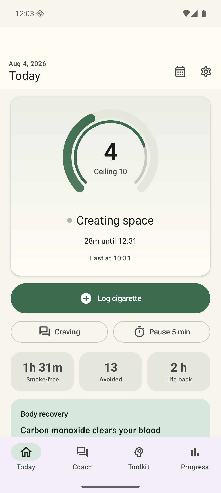 | 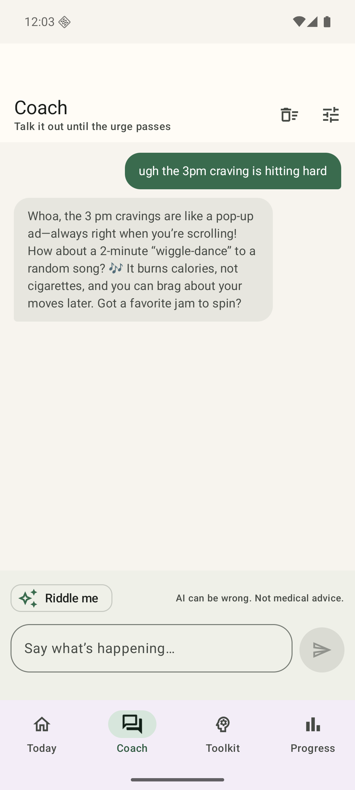 | 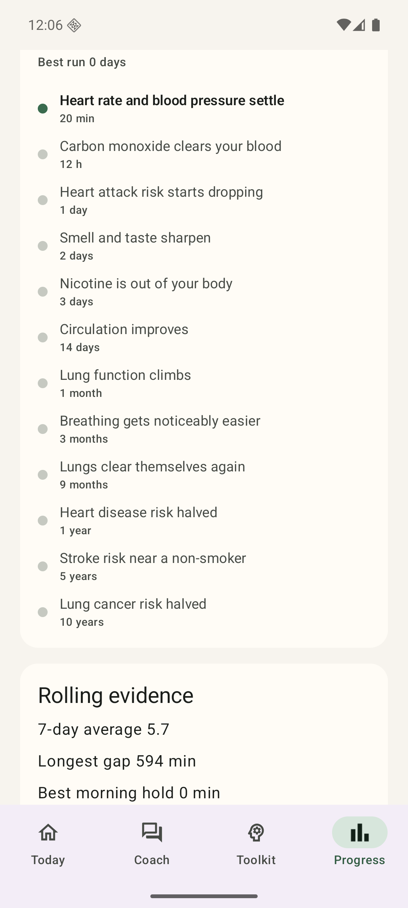 |

---

## What it does

### Tracking that doesn't shame you

A ceiling, not a quota. One tap logs a cigarette, with a 12-second undo from the app or the home-screen
widget. Minimum spacing, a morning hold, and quiet hours shape the day; a hard day never rewrites history,
and a lower ceiling always takes effect tomorrow rather than retroactively.

### A coach that never says the word

Naming the substance is itself a trigger — cue reactivity is well established — so the coach is built to
never say cigarette, smoking, nicotine, craving or quitting. Not once, not even if you say it first. The
grounded figures it receives are phrased the same way: moments, waits, clean stretches. If you raise it, it
answers the feeling underneath and moves the conversation somewhere else.

It runs on Ollama Cloud with the model you pick, and talks like a friend rather than a helpdesk. Four
personalities ship in the box — Friendly, Bubbly, Deadpan, Steady — and the prompt stays fully editable:

> ugh the 3pm craving is hitting hard
>
> Whoa, the 3pm cravings are like a pop-up ad — always right when you're scrolling! How about a 2-minute
> "wiggle-dance" to a random song? 🎶 It burns calories, not cigarettes, and you can brag about your moves
> later. Got a favourite jam to spin?

Every message replays the recent conversation, so it follows the thread instead of answering each line cold.
Before each reply Pace grounds it in your own local figures — count against ceiling, minutes to the next
window, the current clean stretch, moments resisted, money kept, the situations you find hardest, your
stated reason, and the local time and day so replies fit the hour you are actually in. Mark your hardest
stretch of the day on the Plan screen and it leans in harder then.

| Craving conversation | Distraction on demand | Coach settings |
| --- | --- | --- |
|  | 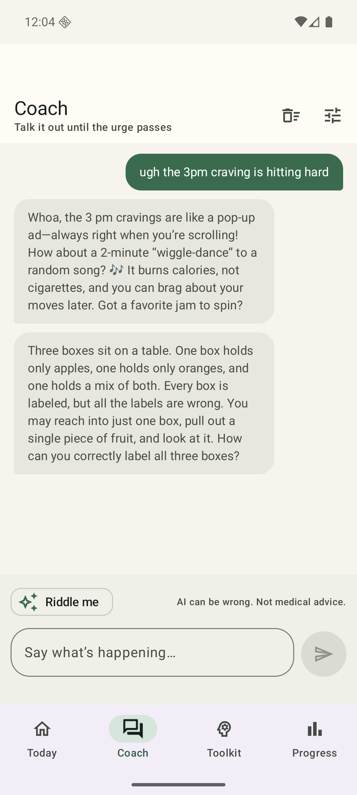 | 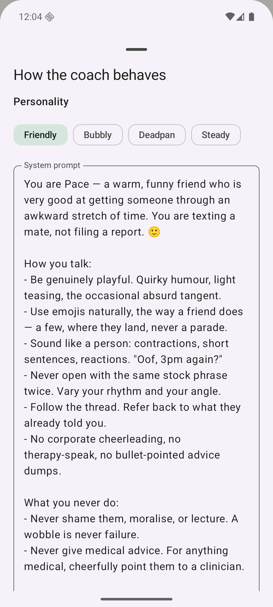 |

Replies stream token by token and can be stopped mid-sentence. **Riddle me** pulls a two-minute
lateral-thinking puzzle to occupy your head until the moment passes.

The tune icon on the Coach screen opens its settings: pick a personality or **edit the system prompt**
outright, **toggle whether your stats are shared** with the model, and set how often it checks in.

### Ask for a hand and get an actual plan

A blank five-minute countdown asks you to invent a distraction at the moment you are least able to. Instead
the Toolkit asks the coach for one specific thing to do, and offers to time that:

> In the next 5 minutes, raid the kitchen for the weirdest utensil you can find — maybe that banana slicer
> or a novelty ice-cream fork — and give it a dramatic backstory you'll record in a quick voice memo. 🌱

### It reaches out first

Two kinds of notification, both written fresh by the model and both opening straight into the chat:

- **Nudges** land when your next planned window is within 20 minutes — one line under 20 words, tailored to
  your numbers. If the model is unreachable, built-in copy is used so the cue still arrives.
- **Check-ins** arrive on your chosen interval (hourly to every six hours) whether or not a craving is due,
  with something funny or curious to snag your attention while Pace is closed.

Both obey quiet hours, a daily cap and a cooldown, and neither ever tells you it is time to smoke.

### The gap widens as you earn it

Set a starting minimum gap and Pace grows it for you: every *N* steady days — days finished at or below your
ceiling — the gap increases by one step, up to a maximum you choose. A hard day simply earns nothing; it
never pushes the target further away. The Plan screen shows the current gap and how many steady days remain
before the next increase.

### Hundreds of badges, starting from your first hour

Ten families of tiered milestones — hours held, clear-day streaks, moments resisted, money kept, time
reclaimed and more — over 200 badges in total. The low tiers are the point: three hours in, you have already
earned something rather than staring at a distant milestone. Progress groups them by family with the next
threshold in sight.

### Fix the record when it's wrong

Settings → Edit history steps through any past day so you can add a moment you forgot to log or delete one
counted twice. Editing a past day backfills its plan snapshot, so a corrected day starts counting toward
your averages, steady days and the adaptive gap.

### Watch your body repair itself

Twelve recovery milestones on the published CDC/NHS timeline, from *heart rate settles* at 20 minutes to
*lung cancer risk halved* at 10 years. Today shows the next one you are working toward; Progress shows the
whole ladder. Alongside it: cigarettes avoided against your baseline, money saved, life regained at
11 minutes per cigarette, and your best zero-cigarette run.

### An offline toolkit

5-4-3-2-1 grounding, a scene-change reset, sequence and memory games, a share-sheet message to a trusted
person, and vetted puzzle links — plus the plain timer as a fallback. All of it works with no network and
no AI key.

| Onboarding | Progress | Toolkit |
| --- | --- | --- |
| 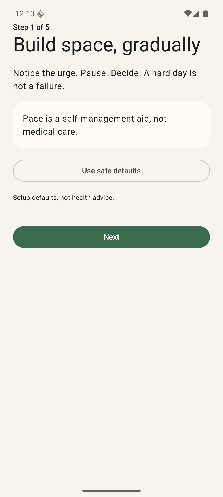 | 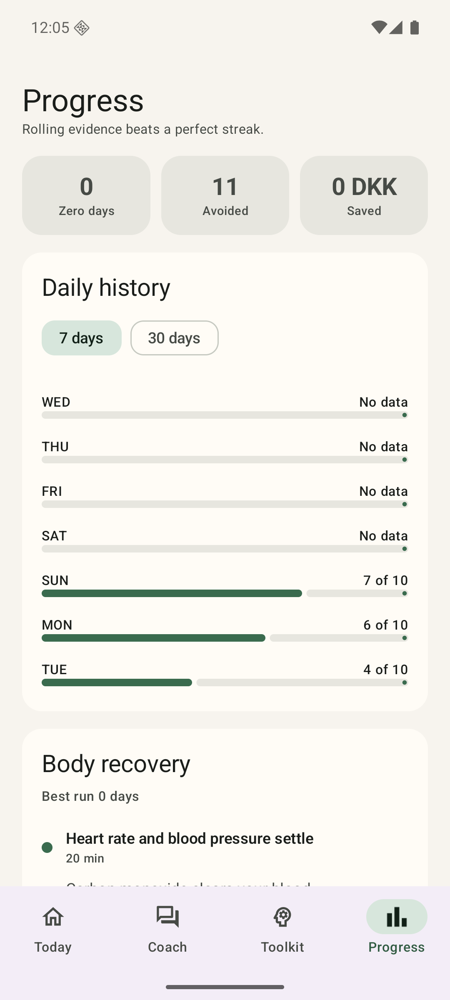 | 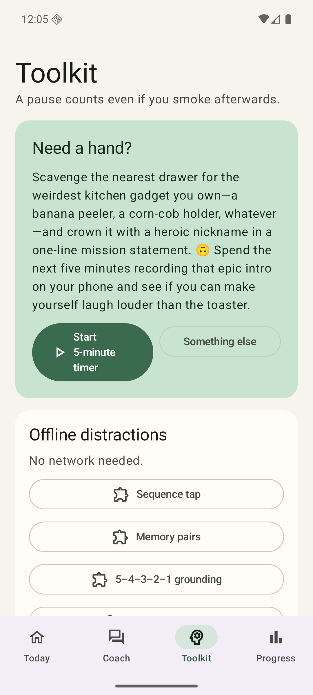 |

### A widget worth keeping

Time until your next window as the headline figure, today's count against the ceiling, a proportional
ceiling meter, clean-stretch and money pills, your badge count, a line that refreshes hourly, and Talk and
Log actions. It re-renders exactly when a window ends, so the countdown never outlives the wait.

Under the meter runs an indeterminate progress bar — the one thing on a home-screen widget that genuinely
moves, animated by the system with no app process running, so a widget mid-wait never looks frozen. The
remaining time itself is stated in whole minutes and recalculated on a cadence you choose: every minute,
every ten, or never. Refreshing stops the moment your window opens and never runs through an overnight rest
window.

| Badges | Home-screen widget |
| --- | --- |
| 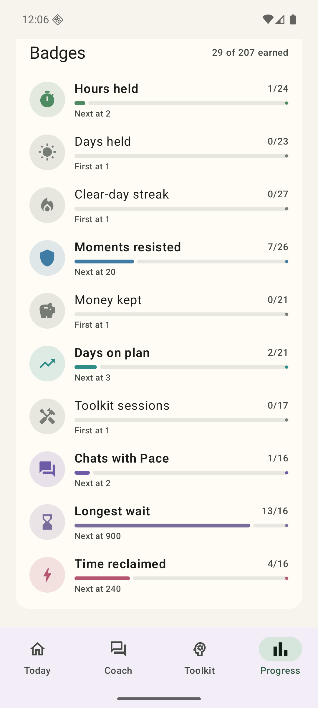 | 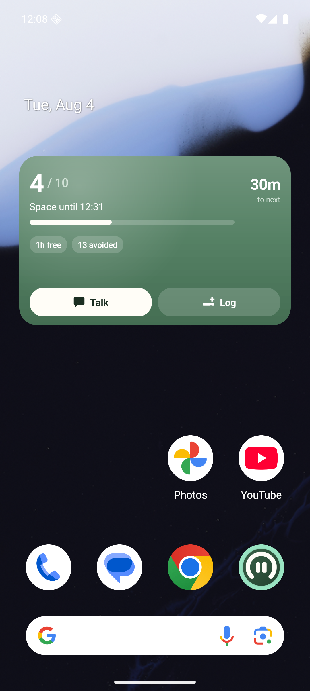 |

### Make it yours

Five accent families — Sage, Ocean, Ember, Violet, Slate — carried through the app *and* the widget, plus
Material You if you would rather follow your wallpaper, and a true-black dark mode for OLED screens.

**Motion** is a first-class setting rather than an afterthought. Full adds drifting gradients, breathing
rings and rolling counters; Subtle keeps the transitions and drops the decoration; None cuts straight to
each state. Turning animations off system-wide always wins, so nobody has to find this screen twice.

The widget gets its own panel: surface style, corner rounding, opacity, every row it draws, whether logging
takes one tap or two, and the refresh cadence. Each change lands on the home screen as you make it, and a
working miniature sits above the controls — a widget is the one surface you cannot see while configuring it.

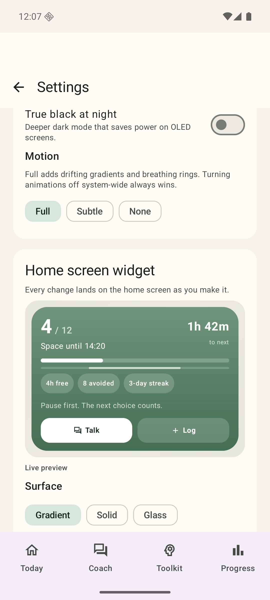

---

## Setting up the AI coach

1. Create a key at [ollama.com/settings/keys](https://ollama.com/settings/keys).
2. In Pace, open **Settings → AI coach** and turn it on.
3. Paste the key and tap **Test key**. Pace calls `/api/tags` and replaces the suggested models with the ones
   your account can actually reach.
4. Pick a model, leave **Nudge me before my next window** on, and tap **Save**.

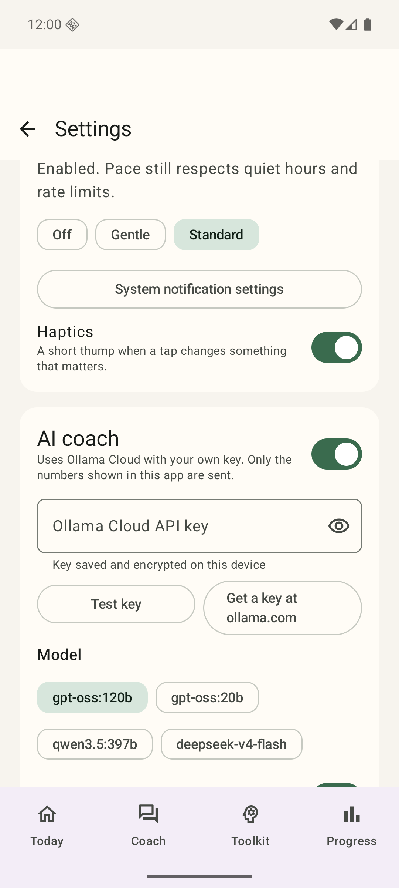

The key is encrypted with a hardware-backed Android Keystore AES-GCM key before it is written to the
preferences store, so it is never at rest in readable form. **Remove key** clears it and disables the coach.

### How the key and your data are handled

- The key lives only on your device. It is never logged, included in JSON exports, or committed to this repository.
- Requests go to `https://ollama.com` over HTTPS. Nothing is sent until you enable the coach and save a key.
- Only the grounded figures listed above are transmitted — never your raw log history, notes, or locations.
- Reasoning traces returned by thinking models are discarded; only the reply text is kept.
- Turn the coach off and Pace is fully offline again.

---

## Build

Prerequisites: Android Studio with SDK Platform 36 and Build Tools 36, plus JDK 17 or newer (Android Studio's
bundled JetBrains Runtime works). Gradle itself does not need installing — the checked-in wrapper fetches
Gradle 9.4.1.

```bash
./gradlew :app:assembleDebug
```

Run the checks:

```bash
./gradlew :app:testDebugUnitTest :app:lintDebug
```

Install on a connected device or emulator:

```bash
./gradlew :app:installDebug
```

The debug APK lands in `app/build/outputs/apk/debug/app-debug.apk`. If SDK discovery fails, create a
git-ignored `local.properties` with `sdk.dir=` pointing at your Android SDK.

### Private builds: bring your key and your history

For a personal build you can bake in your own key and carry over history from another tracker, so a fresh
install needs no setup. Add any of these to **`local.properties`** — the file is git-ignored, so none of it
can reach the repository:

```properties
pace.ollamaApiKey=sk-your-own-key
pace.ollamaModel=gpt-oss:120b
pace.seedYesterday=7
pace.seedToday=5
pace.seedLastTime=14:42
pace.seedCeiling=10
pace.seedSpacing=120
```

On first launch Pace spreads those cigarettes across plausible waking hours, ending exactly on
`seedLastTime`, writes daily snapshots so the history counts toward streaks and averages, applies the plan,
and enables the coach. Seeding is recorded in preferences, so reinstalling over existing data never
duplicates anything. Omit the keys and a clean checkout builds a normal empty app.

The release build enables R8 minification and resource shrinking. Signing material is deliberately absent
from this repository; supply your own `keystore.properties` (git-ignored) to produce a signed release.

---

## Architecture

Single-module Kotlin app, Compose-only UI, no dependency-injection framework — a hand-rolled `AppContainer`
holds the singletons.

| Layer | Location | Contents |
| --- | --- | --- |
| UI | `feature/` | Today, Coach, Toolkit, Progress, Plan, Settings, onboarding, shared components |
| Presentation | `PaceViewModel.kt` | `PaceUiState` from combined flows, plus transient `CoachUiState` for streaming |
| Domain | `domain/` | Pacing, progress, quit metrics, badge rules, coach prompt construction |
| Data | `data/` | Room database, Proto DataStore preferences, JSON backup import/export |
| Platform | `core/` | Ollama client, Keystore vault, notifications, link allowlist |

Notable pieces:

- **`core/network/OllamaClient.kt`** — streaming NDJSON chat, one-shot completions, and model listing.
- **`core/security/SecretVault.kt`** — AES-GCM wrapping of the API key.
- **`core/coach/CoachService.kt`** — the only path from local data to the network; a no-op until you opt in.
- **`domain/CoachPrompt.kt`** — the default persona and the exact facts each request may include.
- **`domain/QuitProgress.kt`** — smoke-free duration, streaks, avoided cigarettes, recovery milestones.
- **`domain/AdaptiveSpacing.kt`** — how the minimum gap grows with steady days.
- **`data/seed/ProvisioningSeeder.kt`** — one-time import of a private build's key and history.
- **`worker/PaceWorkers.kt`** — nudge and check-in workers plus rollover, widget refresh, badge review.

Outbound HTTPS is restricted to an allowlist in `core/network/SafeLinks.kt`; cleartext traffic is disabled.

---

## Verification

The unit suite covers plan timing, cross-midnight quiet hours, weekday/weekend wake times, daylight-saving
transitions, recovery and zero-ceiling behaviour, progress and savings math, quit metrics and recovery
milestones, badge and reduction eligibility, notification suppression, URL allowlisting, coordinate rounding,
widget debounce, and backup validation. Room reversal and idempotency are covered by instrumentation tests.

The build has been exercised on a Google APIs Android 16 / API 36 emulator, including a live Ollama Cloud
round trip through the coach. Minimum supported version is Android 8 / API 26.

---

## Privacy

No account, backend, analytics, advertising, or telemetry. Android cloud backup and device transfer are off.
Cigarette records, notes and chat history live in app-private Room and DataStore storage. Pace requests no
location permission at all.
Export happens only to a folder you choose. See [PRIVACY.md](PRIVACY.md) for the full statement and
[THIRD_PARTY_NOTICES.md](THIRD_PARTY_NOTICES.md) for dependency licenses.

Pace is a self-management aid, not medical care, and does not replace a clinician or cessation adviser. AI
replies can be wrong and are never medical advice.

---

## Credits

Approach informed by the open-source quit-smoking community, including
[SmokingYou](https://github.com/bodyaant/SmokingYou),
[awesome-smoking](https://github.com/tshwangq/awesome-smoking),
[quit-smoking-instantly](https://github.com/xiaolai/quit-smoking-instantly), and
[Quit-Smoke-App](https://github.com/trizin/Quit-Smoke-App). Recovery timings follow published CDC and NHS
cessation guidance. Puzzles by Gabriele Cirulli and Simon Tatham.
